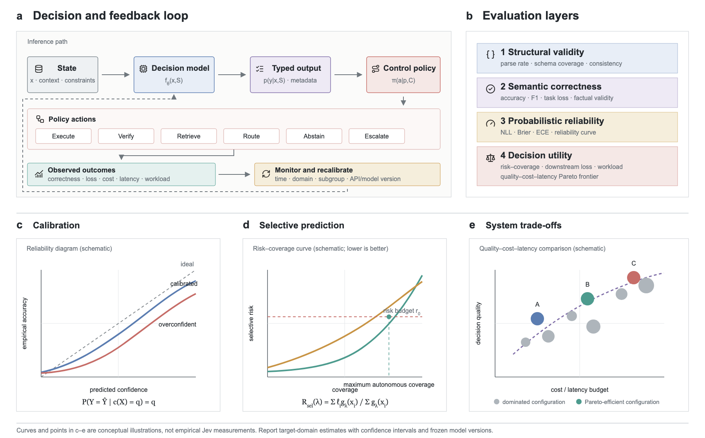

# Awesome Jev 

A curated, evidence-graded index of **Jev**, typed probabilistic interfaces, calibrated decision models, selective prediction, constrained generation, and cost-aware model routing.

中文说明：这个仓库不只收集 Jev 链接，也整理其背后的学术谱系、可复现实验协议和机器可读资源表。厂商材料与同行评议证据分开标记，便于检索和复用。

[中文 README](README.zh-CN.md)

## Contents

- [Scope](#scope)
- [Evidence labels](#evidence-labels)
- [Official Jev resources](#official-jev-resources)
- [Ecosystem repository index](#ecosystem-repository-index)
- [Concept map](#concept-map)
- [Paper index](#paper-index)
- [Evaluation resources](#evaluation-resources)
- [Reproducible comparison protocol](#reproducible-comparison-protocol)
- [Survey and figures](#survey-and-figures)
- [Contributing](#contributing)

## Scope

TypeSafe introduced **System One Models** under its broader **Machine-Native Intelligence** thesis and released Jev as the first public instance. This repository uses **machine-native decision model** as an umbrella analytical term that connects that industrial category to the longer research lineages of classification, structured prediction, constrained generation, calibration, selective prediction, and routing. The category-level thesis is attributed to TypeSafe; the accompanying survey contributes the operational boundary, five-dimensional taxonomy, and four-layer evaluation framework.

Operationally, a machine-native decision model maps state and a predeclared decision specification to a typed value or probability distribution intended for direct software consumption. Useful systems connect uncertainty to execution, verification, routing, abstention, or escalation.

The repository distinguishes four evaluation layers:

1. **Structural validity** — does the output satisfy its type or schema?
2. **Semantic correctness** — is the selected decision correct?
3. **Probabilistic reliability** — do stated probabilities match empirical frequencies?
4. **Decision utility** — does acting on the output improve the workflow objective?

## Evidence labels

- **[A] Peer reviewed** — archival conference or journal publication.
- **[B] Preprint** — public manuscript without the same archival status.
- **[C] Official** — vendor documentation, first-party code, or a first-party benchmark.
- **[D] Community** — third-party implementation or evaluation; protocol and version should be checked.

Inclusion does not imply endorsement. Performance claims should be tied to a versioned protocol and an evidence label.

## Official Jev resources

- **[C] [Machine-Native Intelligence](https://typesafe.ai/)** — TypeSafe's first-party umbrella framing for the direction.
- **[C] [Introducing System One Models and Jev](https://typesafe.ai/blog/introducing-system-one-models-and-jev)** — launch article and first-party architecture/training narrative.
- **[C] [TypeSafe documentation](https://docs.typesafe.ai/introduction)** — concepts, primitives, and API entry point.
- **[C] [System One](https://docs.typesafe.ai/concepts/system-one)** — first-party definition of the product category.
- **[C] [Confidence](https://docs.typesafe.ai/confidence)** — interpretation of confidence exposed by the API.
- **[C] [Workflow evaluations](https://evals.typesafe.ai/)** — first-party evaluation dashboard; treat results as vendor-reported until independently reproduced.
- **[C] [System One adapter for Python](https://github.com/typesafe-ai/system-one-adapter-python)** — compatible interface backed by conventional LLM APIs.

## Ecosystem repository index

Verified snapshot: **2026-09-21**. `Official` means maintained by TypeSafe; `Community` means independently maintained. Descriptions summarize repository claims and do not imply that performance or calibration claims have been independently reproduced. A machine-readable version is available in [`data/ecosystem.yml`](data/ecosystem.yml).

### Official SDKs and developer resources

- **Official · JavaScript/TypeScript — [typesafe-sdk-js](https://github.com/typesafe-ai/typesafe-sdk-js):** official client with inferred answer types.
- **Official · Python — [typesafe-sdk-python](https://github.com/typesafe-ai/typesafe-sdk-python):** official synchronous and asynchronous Python client.
- **Official · Baseline adapter — [system-one-adapter-python](https://github.com/typesafe-ai/system-one-adapter-python):** exposes the TypeSafe interface over OpenAI-, Anthropic-, and compatible LLM APIs for controlled comparison.
- **Official · Agent skills — [skills](https://github.com/typesafe-ai/skills):** workflow-design and evaluation guidance for Claude Code, Codex, and compatible agents.

### Open models and Jev-style replicas

These projects do not distribute TypeSafe's Jev weights. They reproduce the interface, direct candidate scoring, non-autoregressive decision heads, or related System One behavior.

- **Community · [SemIf](https://github.com/TheoLeeCJ/SemIf):** semantic `if` decisions from open models on local hardware.
- **Community · [jevlike](https://github.com/vinnylarouge/jevlike):** scores dynamic text options directly instead of generating JSON.
- **Community · [openjev](https://github.com/razorback16/openjev):** Jev-compatible System One server built on DiffusionGemma.
- **Community · [decider](https://github.com/Mapika/decider):** one-pass typed decisions with calibrated probabilities, fine-tuned from Qwen3.5-2B.
- **Community · [reflex](https://github.com/kshetrajna12/reflex):** compact open decision model over state and typed questions.
- **Community · [von](https://github.com/wfzyx/von):** non-autoregressive local System One implementation; latency claims are project-reported.

### Framework and platform integrations

- **Community · Agents — [eve](https://github.com/vercel/eve):** Vercel's agent framework, with Jev used in its experimental evaluation path.
- **Community · PostgreSQL — [pg-jev](https://github.com/realZachi/pg-jev):** asks typed natural-language questions over PostgreSQL tables.
- **Community · Home automation — [HA-Jev](https://github.com/AboveColin/HA-Jev):** exposes Jev decisions as Home Assistant entities and actions.
- **Community · RAG — [llama-index-jev](https://github.com/WiktorB2004/llama-index-jev):** LlamaIndex reranking and routing with typed Jev scores and choices.
- **Community · Workflow automation — [n8n-nodes-jev](https://github.com/vibe-with-me-tools/n8n-nodes-jev):** n8n node for classification, routing, scoring, and review thresholds.

### Applications and decision tools

- **Community · Email — [jevmail](https://github.com/fazlerocks/jevmail):** local, read-only Gmail triage through the Vercel AI Gateway.
- **Community · Agent safety — [agent-chaperone](https://github.com/agent-chaperone/agent-chaperone):** screens tool calls and results through an MCP proxy and hooks adapter.
- **Community · Coding agents — [jev-engineering](https://github.com/eugeniughelbur/jev-engineering):** tool-call gating, model routing, ranking, and an injection test suite.
- **Community · Human feedback — [jev-align](https://github.com/sutro-sh/jev-align):** active-learning workflow for improving Jev decision definitions from labels.
- **Community · Search — [reranker](https://github.com/hev/reranker):** calibrated Jev reranking for up to 30 documents per call.
- **Community · Production patterns — [jev-usecases](https://github.com/kenhuangus/jev-usecases):** confidence-gated use-case harnesses and explicit action policies.
- **Community · Examples — [typesafe-jev-examples](https://github.com/rajivkuriakose/typesafe-jev-examples):** runnable decision workflows, offline policy tests, and OpenRouter access.

### Evaluation, measurement, and playgrounds

- **Community · Measurement — [jev-measured](https://github.com/WallerChen/jev-measured):** raw cost, latency, and output records across eight use cases.
- **Community · Playground — [typesafe-ai-playground](https://github.com/markjaquith/typesafe-ai-playground):** experiments across direct TypeSafe and OpenRouter decision endpoints.
- **Community · Showcase — [Jev](https://github.com/cobusgreyling/Jev):** documented operator-facing showcase and interactive examples.
- **Community · Quickstart — [jev-ai](https://github.com/codaaiteam/jev-ai):** introductory guide and third-party playground; not affiliated with TypeSafe.

### Larger ecosystem directories

These lists are broader and update more frequently; use their entries as discovery leads and verify each repository independently.

- **[hellogumbo/awesome-jev](https://github.com/hellogumbo/awesome-jev)** — large community directory spanning SDKs, integrations, applications, games, and evaluations.
- **[valentynkit/awesome-jev-typesafe](https://github.com/valentynkit/awesome-jev-typesafe)** — install-oriented index covering agents, open replicas, routing, safety, and demos.
- **[logicrw/awesome-jev-projects](https://github.com/logicrw/awesome-jev-projects)** — automatically refreshed ecosystem radar.
- **[cobanov/awesome-jev](https://github.com/cobanov/awesome-jev)** — source-backed list organized around decision intelligence and agent workflows.

## Concept map

| Layer | Main question | Closest research traditions |
|---|---|---|
| Output contract | What values can the model return? | Classification, structured prediction, formal grammars |
| Inference | How are alternatives and dependencies compared? | Encoders, energy models, constrained autoregressive decoding |
| Learning objective | What behavior is optimized? | Proper scoring rules, selective losses, decision-focused learning, RL |
| Uncertainty | What event does confidence describe? | Calibration, ensembles, semantic entropy, conformal prediction |
| System control | What happens after prediction? | Abstention, learning to defer, cascades, model routing |

## Paper index

The index is organized by the role a paper plays in a machine-native decision pipeline. Entries are ordered chronologically within each category. The code in backticks is the citation key in [`paper/references.bib`](paper/references.bib).

| Category | Papers | What it covers |
|---|---:|---|
| [Foundations and structured prediction](#foundations-and-structured-prediction) | 3 | Finite and globally constrained decision spaces |
| [Typed output and constrained decoding](#typed-output-and-constrained-decoding) | 3 | Grammar, schema, and parse guarantees |
| [Calibration and uncertainty](#calibration-and-uncertainty) | 9 | Probability quality, confidence, and distribution shift |
| [Selective prediction and deferral](#selective-prediction-and-deferral) | 6 | Abstention, escalation, and human/model handoff |
| [Decision-focused learning](#decision-focused-learning) | 2 | Optimizing downstream action utility |
| [Routing, cascades, and dynamic inference](#routing-cascades-and-dynamic-inference) | 7 | Quality--cost allocation across models and skills |
| [Calibration-aware decision training](#calibration-aware-decision-training) | 2 | Joint task performance and calibrated confidence |

### Foundations and structured prediction

- **[A · 2016 · ICML] [Structured Prediction Energy Networks](https://proceedings.mlr.press/v48/belanger16.html)** — global scoring over structured outputs. `belanger2016spen`
- **[A · 2020 · ACL] [Calibrating Structured Output Predictors for NLP](https://aclanthology.org/2020.acl-main.188/)** — sequence-level calibration beyond independent labels. `jagannatha2020structured`
- **[A · 2026 · EACL] [Mapping the Course for Prompt-Based Structured Prediction](https://aclanthology.org/2026.eacl-long.160/)** — systematic account of prompt-based structured prediction. `pauk2026structured`

### Typed output and constrained decoding

- **[A · 2021 · EMNLP] [PICARD](https://aclanthology.org/2021.emnlp-main.779/)** — incremental parsing that rejects invalid text-to-SQL continuations. `scholak2021picard`
- **[A · 2023 · EMNLP] [Grammar-Constrained Decoding for Structured NLP Tasks](https://aclanthology.org/2023.emnlp-main.674/)** — formal and input-dependent grammars without finetuning. `geng2023grammar`
- **[B · 2025 · arXiv] [Generating Structured Outputs from Language Models](https://arxiv.org/abs/2501.10868)** — JSONSchemaBench with 10,000 real-world schemas. `geng2025jsonschema`

### Calibration and uncertainty

- **[A · 2017 · ICML] [On Calibration of Modern Neural Networks](https://proceedings.mlr.press/v70/guo17a.html)** — temperature scaling and the modern neural calibration baseline. `guo2017calibration`
- **[A · 2019 · NeurIPS] [Can You Trust Your Model's Uncertainty?](https://proceedings.neurips.cc/paper/2019/hash/8558cb408c1d76621371888657d2eb1d-Abstract.html)** — uncertainty evaluation under natural and synthetic dataset shift. `ovadia2019shift`
- **[A · 2020 · EMNLP] [Calibration of Pre-trained Transformers](https://aclanthology.org/2020.emnlp-main.21/)** — in-domain and out-of-domain calibration in pretrained NLP models. `desai2020calibration`
- **[A · 2021 · TACL] [How Can We Know When Language Models Know?](https://doi.org/10.1162/tacl_a_00407)** — calibration for language-model question answering. `jiang2021know`
- **[B · 2022 · arXiv] [Teaching Models to Express Their Uncertainty in Words](https://arxiv.org/abs/2205.14334)** — learned verbalized probabilities. `lin2022verbalized`
- **[B · 2022 · arXiv] [Language Models (Mostly) Know What They Know](https://arxiv.org/abs/2207.05221)** — P(True), P(IK), scale, and cross-task behavior. `kadavath2022know`
- **[A · 2023 · Machine Learning] [Classifier Calibration: A Survey](https://doi.org/10.1007/s10994-023-06336-7)** — metrics, calibration maps, and failure modes. `silvafilho2023calibration`
- **[A · 2024 · Nature] [Detecting Hallucinations Using Semantic Entropy](https://doi.org/10.1038/s41586-024-07421-0)** — uncertainty over meanings rather than strings. `kuhn2024semantic`
- **[B · 2025 · arXiv] [Uncertainty Quantification and Confidence Calibration in LLMs: A Survey](https://arxiv.org/abs/2503.15850)** — LLM-focused uncertainty and calibration taxonomy. `liu2025uqsurvey`

### Selective prediction and deferral

- **[A · 2018 · NeurIPS] [Predict Responsibly](https://proceedings.neurips.cc/paper/2018/hash/09d37c08f7b129e96277388757530c72-Abstract.html)** — joint prediction and deferral to an external decision maker. `madras2018defer`
- **[A · 2019 · ICML] [SelectiveNet](https://proceedings.mlr.press/v97/geifman19a.html)** — integrated reject option and risk--coverage optimization. `geifman2019selectivenet`
- **[A · 2022 · RepL4NLP] [Towards Improving Selective Prediction Ability of NLP Systems](https://aclanthology.org/2022.repl4nlp-1.23/)** — selective behavior and confidence ranking in NLP. `varshney2022selective`
- **[A · 2022 · NeurIPS] [Post-hoc Estimators for Learning to Defer](https://proceedings.neurips.cc/paper_files/paper/2022/hash/bc8f76d9caadd48f77025b1c889d2e2d-Abstract.html)** — error probability, expert cost, and adaptive inference. `narasimhan2022defer`
- **[A · 2023 · ACL] [Evaluation of Neural Selective Prediction for NLP](https://aclanthology.org/2023.acl-long.437/)** — evaluation methodology and distribution-shift sensitivity. `gu2023selective`
- **[A · 2024 · ICLR] [Conformal Language Modeling](https://openreview.net/forum?id=pzUhfQ74c5)** — calibrated stopping and rejection for set-valued generation. `quach2024conformal`

### Decision-focused learning

- **[A · 2019 · AAAI] [Melding the Data-Decisions Pipeline](https://doi.org/10.1609/aaai.v33i01.33011658)** — optimize predictions through downstream combinatorial decisions. `wilder2019decision`
- **[B · 2023 · arXiv] [Decision-Focused Learning: Foundations, Benchmark and Opportunities](https://arxiv.org/abs/2307.13565)** — foundations, method families, benchmark, and open problems. `mandi2023dfl`

### Routing, cascades, and dynamic inference

- **[B · 2023 · arXiv] [FrugalGPT](https://arxiv.org/abs/2305.05176)** — learned LLM cascades for quality--cost trade-offs. `chen2023frugalgpt`
- **[B · 2024 · arXiv] [RouteLLM](https://arxiv.org/abs/2406.18665)** — preference-data routing between stronger and weaker models. `ong2024routellm`
- **[A · 2025 · Findings of EMNLP] [RouterEval](https://aclanthology.org/2025.findings-emnlp.208/)** — model-level routing at large candidate-pool scale. `huang2025routereval`
- **[A · 2026 · EACL] [How Robust Are Router-LLMs?](https://aclanthology.org/2026.eacl-long.351/)** — category bias, privacy, safety, and router fragility. `kassem2026routerfragility`
- **[A · 2026 · Findings of ACL] [LLMRouterBench](https://aclanthology.org/2026.findings-acl.1881/)** — unified benchmark covering 400,000+ instances, 21 datasets, and 33 models. `li2026routerbench`
- **[B · 2026 · arXiv] [SkillRouter](https://arxiv.org/abs/2603.22455)** — skill routing for large-scale LLM-agent systems. `zheng2026skillrouter`
- **[B · 2026 · arXiv] [The Router Within](https://arxiv.org/abs/2609.15982)** — native skill routing elicited from a frozen LLM. `chen2026routerwithin`

### Calibration-aware decision training

- **[A · 2024 · ICLR] [RLCD: Reinforcement Learning from Contrast Distillation](https://openreview.net/forum?id=v3XXtxWKi6)** — acronym collision: this RLCD is unrelated to TypeSafe's Reinforcement Learning for Calibrated Decisions. `yang2024rlcd`
- **[A · 2026 · Findings of ACL] [Balancing Classification and Calibration in Decision-Making LLMs](https://aclanthology.org/2026.findings-acl.610/)** — calibration-aware reinforcement learning for task performance and overconfidence. `yaldiz2026calibrationrl`

## Evaluation resources

Minimum reporting bundle:

- **Task quality:** accuracy/F1 or task loss, class balance, and confidence intervals.
- **Probability quality:** NLL, Brier score, ECE/ACE, and reliability diagrams.
- **Selection:** risk–coverage curve, AURC, coverage at fixed risk, escalation rate.
- **Structure:** strict parse rate, schema-feature coverage, and cross-field consistency.
- **Operations:** p50/p95/p99 latency, throughput, retries, monetary cost, and human workload.
- **Robustness:** temporal/domain shift, template perturbation, subgroup slices, and model-version drift.

## Reproducible comparison protocol

Compare at least four families under the same information and output space:

1. a discriminative encoder or classical classifier;
2. a general LLM with native structured output;
3. the same LLM exposed through the compatible adapter;
4. the Jev endpoint and typed interface.

Freeze prompts, schema, model identifiers, dates, decoding parameters, retries, prices, and raw outputs. Use independent labels or executable validators. Present a quality–cost–latency Pareto surface alongside calibration and risk–coverage results. Separate first-party results from independent replications.

## Survey and figures

- [Chinese Markdown survey](paper/survey_zh.md)
- [English LaTeX survey](paper/main.tex)
- [BibTeX database](paper/references.bib)
- [Machine-readable resource catalog](data/resources.yml)
- [Machine-readable ecosystem catalog](data/ecosystem.yml)
- [Editable HTML source for Figure 1](assets/fig1_machine_native_landscape.html)
- [Editable HTML source for Figure 2](assets/fig2_evaluation_control_loop.html)
- [Figure contract and QA notes](assets/FIGURES.md)

## Contributing

Suggestions and corrections are welcome. Please read [CONTRIBUTING.md](CONTRIBUTING.md). Every resource should include a stable URL, evidence label, one-sentence relevance note, and access date for mutable pages.

## License

The repository's original text and code are available under the [Apache License 2.0](LICENSE). Figure glyphs use [Lucide](assets/icons/LICENSE) under its bundled open-source license. Linked papers, documentation, names, and trademarks retain their respective rights.
