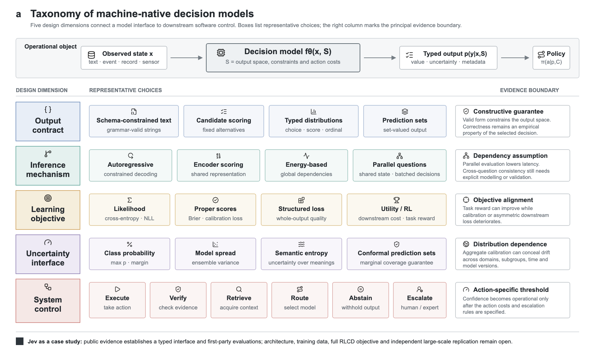

# 🌟 决策，而非 Token：从经典分类器到 Jev 的类型化、校准化与机器原生决策模型综述

> **版本说明（2026-09-21）**：本文将 Jev 视为一个新近发布、文档有限的商业案例。有关接口、速度、价格和训练方法的陈述均区分公开文档、厂商自报与独立学术证据。引用采用 Pandoc 键值格式，对应同目录的 `references.bib`。

## 摘要

大语言模型将自然语言变成通用计算接口，也把内容生成带入检索、客服、代码执行和智能体工作流；然而，许多软件环节只需要一个判断、一个有限集合中的选择或一个可触发动作的分数。开放式文本进入控制流时，通常还需经过解析、校验、复核和权限控制。TypeSafe AI 于 2026 年 9 月在“Machine-Native Intelligence”叙事下提出“System One Models”这一模型类别，并发布首个公开模型 Jev：系统输入状态与类型化问题，模型直接返回 Choice、Score 或 Noul 及相应概率 [@typesafe2026home; @almeida2026jev; @typesafe2026systemone; @typesafe2026docs]。其发布材料报告 70--500 ms 端到端延迟和每百万输入 token 0.042 美元的价格；这些数字来自第一方测试，尚待独立复现 [@almeida2026jev]。本文沿用这一问题设定，将“机器原生决策模型”（machine-native decision model）作为连接该工业类别与既有学术研究的上位分析术语，并给出操作性定义：给定环境状态和预先声明的决策规范，模型返回可被程序确定性解析的类型化值或概率分布，并将不确定性传递给执行、复核、路由、拒答或人工升级策略。本文以输出契约、推断机制、学习目标、不确定性接口和系统控制五个维度组织结构化预测、受约束解码、概率校准、选择性预测、学习拒答、决策导向学习和多模型路由，并建立覆盖结构有效性、语义正确性、概率可靠性、选择性风险、延迟、成本与分布偏移的评价框架。综合现有证据，类型约束能够构造性地排除部分接口错误，校准使概率在指定分布和分组条件下具有统计解释，选择性策略则把不确定性转化为控制规则；三者仍需与任务损失、分布变化、动作代价和工作流结果联合评价。

**关键词：** 机器原生决策模型；Jev；概率校准；选择性预测；结构化输出；模型路由；决策导向学习

## 1. 引言：软件需要什么样的模型输出？
大语言模型将自然语言变成了通用计算接口，也把内容生成带入检索、客服、代码执行和智能体工作流。然而，生产系统中的许多步骤并不需要一段面向人的回答：客服系统要把“信用卡被重复扣款”的工单路由到 billing、technical 或 account，智能体要判断一次工具调用应继续执行、复核还是终止，风控系统则需要一个能够触发阻断或人工升级的分数。开放式生成在这些场景中容易提供超出任务所需的信息，并把格式解析、事实核验和权限控制留给下游。工程团队因而常在模型外叠加 JSON 解析、重试、规则校验、LLM-as-a-judge、强模型复核与人工兜底；这些组件可以降低特定失败的概率，也会累积延迟、调用费用和新的误差来源。

TypeSafe 将这一接口矛盾概括为面向人的字符串与面向软件的决策之间的错配。该公司在“Machine-Native Intelligence”叙事下提出“System One Models”，将其定义为一类为软件快速生成结构化决策的新模型；Jev 是首个公开实例 [@typesafe2026home; @almeida2026jev; @typesafe2026systemone]。在官方给出的退款流程中，系统把客户消息、交易记录和退款政策组成状态，同时询问用户是否请求退款、证据是否表明重复扣款以及政策是否支持退款，再由代码组合多个答案并决定执行或复核 [@typesafe2026systemone]。Jev 的 Choice、Score 和 Noul 三类原语均在预声明空间内返回结果；官方还报告多问题并行求值、70--500 ms 端到端延迟、每百万输入 token 0.042 美元，以及在特定工作流上 40--200 倍的速度优势 [@typesafe2026docs; @almeida2026jev]。这些结果来自厂商设计的协议，其中参考答案由强模型给出，发布方也说明相关加速处于真实收益的较高端，因此它们构成可检验假设，尚不能替代独立基准。

System One Models 的命名较新，其组成问题已有长期积累。分类器与结构化预测直接产生有限标签或联合结构；受约束解码保证输出属于给定语法或 schema [@scholak2021picard; @geng2023grammar]；概率校准研究置信度与经验正确率的关系；选择性预测和学习拒答决定何时自动处理；决策导向学习与路由进一步纳入动作代价和计算预算。相关基准也显示，接口规模和系统决策必须单独测量：JSONSchemaBench 使用 10,000 个真实 JSON schema 比较约束解码的覆盖率、效率和生成质量 [@geng2025jsonschema]；一项统一路由基准覆盖 40 万余实例、21 个数据集和 33 个模型，发现复杂路由方法在统一协议下未必稳定优于简单基线 [@li2026routerbench]。这些研究共同指向四个相互关联的目标：结构合法、语义正确、概率可信与行动有益。

本文沿用 TypeSafe 提出的机器原生智能与 System One Models 问题设定，并将“机器原生决策模型”作为综述中的上位分析术语，用于连接这一新近工业类别与经典分类器、结构化预测、受约束生成、概率预测和路由器。这里的学术贡献在于概念界定、文献综合与评价体系，而非宣称首创该思想或英文短语。依据从输入到动作的完整链条，我们关注定义、接口、推断、学习、评价和证据六个侧面，并回答以下六个研究问题：

1. 哪些性质足以把模型称为机器原生决策模型？
2. 类型化概率接口与分类器、结构化生成、奖励模型、路由器和智能体有何联系？
3. 准确率、校准、选择性风险与下游效用应如何联合度量？
4. 训练与推断机制怎样塑造这些性质？
5. Jev 的公开证据支持哪些结论，哪些仍属厂商主张？
6. 该方向需要哪些可复现基准与开放研究？

围绕这些问题，本文形成五项贡献：

1. 明确机器原生决策模型的概念来源与边界，给出可检验的操作性定义，并解释该定义为何同时要求预声明决策空间、确定性解析和不确定性驱动的控制策略。
2. 构建输出契约、推断机制、学习目标、不确定性接口与系统控制的五维分类框架，如图 1 所示。
3. 将结构有效性、语义正确性、概率可靠性和决策效用区分为四个评价层，明确各层指标能够支持的结论。
4. 对 Jev 的公开接口、厂商评测和未公开技术细节进行证据审计，区分可确认事实与待复现主张。
5. 提出面向真实部署的基准设计与研究议程，强调质量、成本、延迟和风险的联合比较。

## 2. 范围、方法与证据等级

### 2.1 概念来源与操作性定义

这一概念的直接来源是 TypeSafe 对 Jev 的定位。其官网以“Machine-Native Intelligence”概括总体方向，发布文章与技术文档则明确提出“System One Models”，并将其定义为一类面向软件、能够快速返回类型化决策与概率的模型 [@typesafe2026home; @almeida2026jev; @typesafe2026systemone]。本文据此使用“机器原生决策模型”作为上位分析术语，把该工业命题置于判别式模型、结构化预测、受约束生成、概率预测和路由研究的历史谱系中。概念源头归于 TypeSafe 的产品与研究叙事；本文的增量是给出统一的范围边界、形式化对象、五维分类和四层评价准则。

设环境状态为 $x$，决策规范为 $S=(\mathcal{Y},\tau,C)$，其中 $\mathcal{Y}$ 是允许的输出空间，$\tau$ 是类型或约束，$C(a,y,x)$ 是执行动作 $a$ 在真实结果 $y$ 下的代价。本文将机器原生决策模型形式化为

$$
f_\theta(x,S)=(\hat p(y\mid x,S),m),
$$

其中 $\hat p$ 是关于有限候选、序数或受约束对象的分布，$m$ 为可选元数据。系统策略 $\pi$ 再将预测映射为执行、验证、路由、拒答或人工升级。这里的“机器原生”描述输出与软件控制流之间的关系：调用程序无需从一段开放文本中再次推断模型究竟选择了什么、置信度对应哪个事件或下一步应该采取何种动作。编码器、能量模型和受约束自回归模型都可能实现这一接口，因此该概念不预设单一网络结构。

该定义包含决策规范 $S$，因为同一状态在不同输出空间和代价条件下可能对应不同决策。例如，客服系统在“自动退款/人工复核”二选一时需要估计可执行动作的风险；在“问题类型”多分类时则需要另一组标签和损失。将 $\mathcal{Y}$、类型约束 $\tau$ 与动作代价 $C$ 显式写入任务，可以防止把格式正确、预测正确和行动合理混为一谈，也使模型输出能够直接连接到后续策略。

据此，一个系统至少应满足三项条件。第一，决策空间或输出约束在推断前可声明，使合法结果的边界可由调用方检查。第二，输出可被程序确定性解析，使相同结果不会因自然语言表述差异而触发不同动作。第三，不确定性、拒答或集合外信号进入下游策略，使系统能够在执行、复核与升级之间进行有依据的选择。自由文本经正则表达式提取标签可以视为弱实现，因为其决策语义仍依赖额外解析；仅有类型化接口而缺少概率可靠性和操作策略，则适合数据交换，却不足以单独支撑高风险自动化。

### 2.2 为什么需要分层评价

机器原生决策模型横跨模型输出、概率解释和系统动作，单一准确率无法判断失败发生在哪一层。为此，本文将评价拆为结构有效性、语义正确性、概率可靠性和决策效用四层。该分层具有两项用途：一是限定证据能够支持的结论，例如 schema 通过率只能说明接口合法；二是帮助实验设计定位改进来源，例如准确率不变而风险—覆盖改善，说明收益来自更好的错误排序或拒答策略。四层关系由低到高逐步接近真实工作流，但高层指标仍需要低层诊断才能解释失败原因。

| 层次 | 核心问题 | 代表指标 | 典型反例 |
|---|---|---|---|
| 结构有效性 | 输出是否满足 schema、语法与类型？ | 有效率、解析失败率 | 合法 JSON 中选错客户 |
| 语义正确性 | 决策是否符合标注或可验证事实？ | Accuracy、F1、任务损失 | 概率格式完整但判断错误 |
| 概率可靠性 | 相同置信度的事件是否以相近频率发生？ | NLL、Brier、ECE、可靠性图 | 90% 置信组只对 65% |
| 决策效用 | 采取动作后，整体成本与收益如何？ | 期望效用、风险—覆盖、单位正确决策成本 | 高准确率模型造成昂贵误执行 |

这一区分也约束了对产品和论文主张的解释。文档中“zero hallucinations”若被限定为 schema 匹配，其证据范围停留在结构层，无法推出事实正确或决策安全。语义准确率较高也不保证概率可用于阈值控制；校准是关于样本集合的统计性质，总体校准可以与某个行业、子群或时间段的严重失准并存 [@silvafilho2023calibration]。最终，概率指标的改善还需落实为更低的误执行成本、更高的安全覆盖率或更合理的人工工作量，才能形成系统层收益。

### 2.3 检索与纳入原则

本文围绕 calibration、selective prediction、abstention、learning to defer、structured prediction、constrained decoding、decision-focused learning、LLM routing 与 Jev 检索 ACL Anthology、PMLR、NeurIPS、OpenReview、arXiv 和官方材料。证据分四级：A 为同行评议论文；B 为预印本；C 为厂商文档与代码；D 为社区测试。A 级用于支撑一般性技术结论，B 级用于描述快速发展的方向，C 级仅证明公开接口和自报结果，D 级适合生成待复现假设。本文的检索截止日为 2026 年 9 月 21 日。

## 3. 技术谱系：从预测到可行动决策

机器原生决策模型并未凭空产生，它将若干原本分散的研究问题串联为一条从预测到行动的链条。本节依次讨论五条技术路线：分类与结构化预测规定“可以输出什么”，概率校准解释“分数意味着什么”，选择性预测与学习拒答决定“何时保留自动处理”，决策导向学习回答“应针对何种下游目标训练”，路由与动态计算则决定“把任务交给谁以及投入多少资源”。这一顺序也对应图 1 从输出契约到系统控制的五维框架。

### 3.1 分类、结构化预测与类型契约

经典分类器从输入直接产生有限标签或类别分布，输出空间在训练前已经确定，因此天然具备低歧义、易解析和固定计算图等特点。这种形式适合意图识别、风险分级和布尔判断，却常把复杂动作压缩为彼此独立的标签。当任务要求同时输出多个相关字段、序列或组合对象时，逐标签分类容易产生局部合法但整体矛盾的结果，例如同时预测“无需审批”和“必须人工复核”。由此产生的结构化预测研究把输出视为具有内部依赖的整体对象，并通过图模型、结构化损失或全局评分函数表达变量之间的约束。

Structured Prediction Energy Networks 使用能量函数为完整结构评分，将深度表示与全局约束结合起来 [@belanger2016spen]。这种机制允许模型比较整体输出，而不必把每个字段完全独立地归一化；代价是推断通常需要迭代优化或近似求解。在临床信息抽取等任务中，标签依赖也会改变不确定性的含义：单个 token 的置信度无法完整反映整个序列或事件结构是否可靠，因此校准需扩展到序列级或结构级对象 [@jagannatha2020structured]。结构化预测由此提供了机器可读决策的一个核心基础：输出契约既规定字段类型，也描述字段之间允许形成的组合。

大语言模型的受约束生成沿着另一条路线实现同一目标。系统保留自回归模型的表达能力，在每一步根据形式文法、解析状态或 JSON schema 屏蔽非法 token。PICARD 在文本到 SQL 中通过增量解析拒绝无法形成合法查询的候选 [@scholak2021picard]；通用语法约束方法进一步把形式文法与输入相关约束扩展到信息抽取、实体消歧和句法分析 [@geng2023grammar]；JSONSchemaBench 以一万个真实 JSON schema 比较开源库和商业 API 的覆盖范围、效率与生成质量，显示不同引擎对 schema 特性的支持并不等价 [@geng2025jsonschema]。这些结果表明，语法有效性是一项可以独立测量和构造性保证的系统能力，但它只限定输出形式。合法结构中仍可能出现错误事实、错误选项或相互冲突的高层判断，因此下一步必须讨论输出概率能否准确表达模型的错误风险。

### 3.2 概率校准：置信度能否解释？

结构契约解决了“能否被解析”，自动化控制还需要知道“何时值得相信”。若对所有预测置信度接近 $q$ 的样本集合，经验正确率也接近 $q$，模型在给定数据分布、事件定义和分组方式下可称为校准。现代深度网络常出现高置信错误，温度缩放因参数少、实现简单而成为常用后处理基线 [@guo2017calibration]。预训练 Transformer 在部分域内分类任务上比早期神经基线更易校准，分布外误差仍会增大，标签平滑和温度缩放的效果也随任务与数据划分变化 [@desai2020calibration]。问答研究进一步发现，语言模型的 token 概率、模型用文字表达的置信度和答案真实正确率之间没有固定对应关系 [@jiang2021know; @lin2022verbalized]。

大模型有时能够估计“答案为真”或“自己是否知道”，且这种能力会随模型规模和任务形式变化，但跨任务校准并不稳定 [@kadavath2022know]。开放生成还带来事件空间不清的问题：token 熵会把表达相同含义的不同句子计为多个结果，语义熵则先按含义聚类，再估计答案层面的不确定性，并在若干问答任务上改善错误检测 [@kuhn2024semantic]。因此，校准对象应与后续动作保持一致；若系统执行的是某个类别或工具调用，就应校准该决策事件，整段文本的平均 token 概率通常缺乏对应的行动语义。即便概率在离线测试上可解释，系统仍需要一种机制将高风险样本从自动处理流中分离出来，这正是选择性预测和学习拒答所处理的问题。

### 3.3 选择性预测与学习拒答

选择性预测引入选择函数 $g(x)$，系统只在 $g(x)=1$ 时自动回答。覆盖率 $\phi=\mathbb{E}[g(x)]$，选择性风险为

$$
R_{\mathrm{sel}}=\frac{\mathbb{E}[\ell(f(x),y)g(x)]}{\mathbb{E}[g(x)]}.
$$

阈值变化形成风险—覆盖曲线。SelectiveNet 联合学习预测与拒绝，使模型在指定覆盖率下优化风险 [@geifman2019selectivenet]。NLP 评测显示，选择性方法在域内排序良好，并不保证遇到分布偏移仍能识别高风险样本 [@gu2023selective; @varshney2022selective]。因此，单个“置信度大于 0.8”规则缺少普遍语义，阈值应由目标风险、目标覆盖、错误成本及校准集共同确定。

学习拒答进一步把外部专家纳入目标：模型需要同时判断自身预测和交由谁处理。早期工作联合优化模型输出与 PASS 决策，并分析外部决策者的准确性与系统性偏差 [@madras2018defer]；后续方法将基础模型错误概率、专家条件表现和转交成本结合，形成适用于人机协作与自适应推断的后处理门控 [@narasimhan2022defer]。评价对象因而从单个模型扩展为“模型—专家—策略”团队：一个准确率略低但能够识别自身错误的模型，可能在相同人工预算下获得更低的总体损失。这种团队视角自然引出更一般的问题，即训练目标是否应直接面向最终动作效用。

### 3.4 决策导向学习

标准监督学习通常最小化预测误差，而实际系统关心预测触发的行动结果，两者可能明显错位。例如，库存需求的均方误差下降不保证缺货和积压总成本降低；医疗分诊中相同的分类错误率，也可能对应截然不同的漏诊与过度转诊代价。当动作集合、约束和损失函数已知时，决策导向学习将下游优化问题嵌入训练过程，使预测器沿着最终决策质量的梯度更新 [@wilder2019decision; @mandi2023dfl]。这样，模型学习的对象从“尽可能逼近标签”扩展为“提供足以支持高质量决策的信息”。

这一范式通常包含预测、求解和反馈三个环节。预测器首先估计需求、风险或收益，求解器根据估计值选择可行动作，训练目标再比较该动作在真实结果下的后悔值或效用。对于连续且可微的优化问题，可以直接反向传播；面对组合优化、离散约束或黑箱求解器时，则需要可微近似、扰动梯度或代理损失。不同技术实现共享同一判断标准：模型改进应由下游决策质量验证，同时保留常规预测指标，以判断收益来自更准确的预测、对关键样本的重新加权，还是对某一求解器特性的适配。

决策导向目标也带来新的泛化风险。历史代价矩阵可能随业务、法规或资源条件改变，训练时固定的求解器可能诱导模型利用特定近似误差，稀有但代价极高的事件又可能在平均效用中被掩盖。因此，部署评测需要改变代价参数和约束条件进行压力测试，并通过反事实回放、离线策略评估或受控在线实验确认策略收益。对机器原生决策模型而言，这一研究线补上了“概率如何进入行动”的效用层，也为下一节的模型、工具和技能路由提供统一表述。

### 3.5 路由、级联与动态计算

路由将“调用哪个计算单元”本身建模为决策，其动作空间可以是不同规模的语言模型、专家模型、工具、智能体或可复用技能。模型路由常见两类机制。输入级路由在生成前根据查询特征预测各候选模型的表现，额外延迟低，但只能间接估计任务难度；级联方法先调用低成本模型，再根据输出置信度、一致性或验证结果决定是否升级，能够利用中间证据，却会累积调用成本和尾延迟。FrugalGPT 通过级联组合不同 API，在质量与费用之间优化调用策略 [@chen2023frugalgpt]；RouteLLM 利用偏好数据学习强弱模型之间的路由边界 [@ong2024routellm]。这些工作把模型选择从静态配置转化为逐样本决策。

随着候选模型增加，路由器还需同时处理能力估计、成本约束与候选池变化。RouterEval 汇集 8,500 余个模型在 12 类评测上的超过两亿条性能记录，用于研究候选规模扩大后路由器能否稳定获得组合收益；其统一比较也显示现有方法仍有显著改进空间 [@huang2025routereval]。另一项统一基准覆盖 21 个数据集、33 个模型和 40 万余实例，发现若控制数据划分、候选组合与成本定义，多种复杂路由器与简单基线之间的差距会明显缩小 [@li2026routerbench]。因此，路由论文需要报告候选池构成、不可见模型上的泛化、路由开销、预算约束和失败样本分布，而不能只给出平均准确率或费用下降。

技能路由把候选单元从模型扩展为包含指令、工具接口和执行流程的技能模块。技能库规模增大后，将所有技能说明同时放入上下文会带来信息过载，依赖名称与简短描述又容易混淆功能相近的技能。SkillRouter 在约八万个候选技能上研究检索与重排，报告隐藏技能正文会使其测试设置中的路由准确率下降 37--44 个百分点，并据此构建正文感知的两阶段路由器 [@zheng2026skillrouter]。近期工作还尝试直接从冻结模型的中间表示读取技能匹配信号，以减少外部路由模型和上下文占用 [@chen2026routerwithin]。这些结果仍主要来自预印本和特定基准，但它们表明技能选择需要考虑完整能力描述、任务阶段和技能组合兼容性。

路由器本身也必须接受选择性与系统级评测。错误路由可能把安全敏感请求交给能力较弱的模型，或让复杂路由策略在分布变化时退化为固定偏好；已有研究观察到类别僵化和安全请求误路由等脆弱性 [@kassem2026routerfragility]。因此，成熟的动态计算系统应为路由决策输出可解释分数，在低置信情况下保留升级或多路验证，并将最终任务成功率、总成本、尾延迟和安全失败联合计入目标。至此，类型契约、概率校准、选择性策略、决策效用与资源路由形成一条完整的机器原生决策技术链。

## 4. 数学基础：从置信度到可执行策略

### 4.1 类型化概率接口

对于具有 $K$ 个合法选项的决策，模型输出位于概率单纯形

$$
\Delta^{K-1}=\left\{\mathbf p\in[0,1]^K:\sum_{k=1}^{K}p_k=1\right\},
\qquad \hat y=\arg\max_k p_k.
$$

类型系统规定 $\mathbf p$ 可以对应哪些选项，概率模型给出选项之间的相对信念。若真实动作可能不属于 $\mathcal Y$，规范还应加入拒答符号 $\bot$ 或集合外事件；否则即使 $\mathbf p$ 完全满足单纯形约束，系统仍会被迫给出错误的闭集决策。

### 4.2 校准与严格适当评分

令置信度 $c(X)=\max_k p_k(X)$，预测类别为 $\hat Y$。理想的置信度校准满足

$$
\Pr\!\left(Y=\hat Y\mid c(X)=q\right)=q,\qquad q\in[0,1].
$$

有限样本通常将预测按置信度划分为 $M$ 个箱 $B_m$，并估计期望校准误差

$$
\operatorname{ECE}=\sum_{m=1}^{M}\frac{|B_m|}{n}
\left|\operatorname{acc}(B_m)-\operatorname{conf}(B_m)\right|.
$$

ECE 依赖分箱，因而应与严格适当评分规则共同报告。多分类 Brier 分数与负对数似然分别为

$$
\operatorname{BS}=\frac{1}{n}\sum_{i=1}^{n}\sum_{k=1}^{K}
\left(p_{ik}-\mathbb{1}[y_i=k]\right)^2,
\qquad
\operatorname{NLL}=-\frac{1}{n}\sum_{i=1}^{n}\log p_{i,y_i}.
$$

二者利用完整分布，能够惩罚高置信错误。NLL 对接近零的真类概率尤其敏感；Brier 分数更平滑。校准评测仍需同时给出准确率，因为一个总是输出类别基率的模型可以拥有尚可的校准，却缺乏区分能力。

### 4.3 选择性风险、拒答与成本

选择函数 $g_\lambda(x)=\mathbb{1}[c(x)\geq\lambda]$ 把概率转化为自动处理规则。其覆盖率与选择性风险为

$$
\phi(\lambda)=\frac{1}{n}\sum_{i=1}^{n}g_\lambda(x_i),\qquad
R_{\mathrm{sel}}(\lambda)=
\frac{\sum_{i=1}^{n}\ell(f(x_i),y_i)g_\lambda(x_i)}
{\sum_{i=1}^{n}g_\lambda(x_i)}.
$$

风险—覆盖曲线的面积可以写为 $\operatorname{AURC}=\int_0^1R_{\mathrm{sel}}(\phi)\,d\phi$。实际阈值应由动作成本决定。若自动执行的错误代价为 $C_{\mathrm{err}}$，正确执行代价为 $C_{\mathrm{ok}}$，升级代价为 $C_{\mathrm{esc}}$，二元任务在校准概率 $p$ 下执行的条件为

$$
pC_{\mathrm{ok}}+(1-p)C_{\mathrm{err}}\leq C_{\mathrm{esc}}.
$$

该不等式直接给出业务相关阈值，也说明“0.8 置信度”无法脱离代价矩阵解释。

### 4.4 共形覆盖与系统目标

对集合预测器 $\Gamma_\alpha(X)$，共形方法追求有限样本边际覆盖

$$
\Pr\!\left(Y\in\Gamma_\alpha(X)\right)\geq 1-\alpha,
$$

其有效性依赖校准样本与测试样本的交换性等条件 [@quach2024conformal]。在多模型部署中，可以把质量、成本与延迟写成一个受约束目标：

$$
\max_{\pi}\;\mathbb E[U(\pi(X),Y)]-\lambda\mathbb E[C_\pi(X)]-\mu\mathbb E[L_\pi(X)],
\quad\text{s.t.}\quad R_{\mathrm{sel}}\leq r_0.
$$

这里 $\pi$ 同时选择模型和后续动作，$\lambda$、$\mu$ 表示资源偏好，$r_0$ 是可接受风险。该形式把“更准”“更快”“更便宜”转换为可审计的 Pareto 权衡。

## 5. 五维分类框架

前述技术谱系说明了各研究方向的来源，五维框架进一步提供横向比较工具。它把一个系统拆成五个相互制约的问题：输出空间如何声明，候选结果如何推断，训练优化什么目标，不确定性以何种形式暴露，以及下游软件据此采取什么动作。采用多维而非单一类别的原因在于，同一种模型结构可以支持不同输出契约，同一种接口也可能由不同推断与训练机制实现。图 1 展示了各维度的代表选择和主要证据边界；以下小节说明每一维的比较逻辑及其对实验设计的影响。

### 5.1 输出契约

输出契约规定调用方可以预期的结果集合及其解析规则。按照约束强度，可将接口概括为自由文本、schema 约束文本、候选集合打分和原生类型化分布。自由文本保留最大表达空间，却把实体抽取、选项映射和异常处理交给下游解析器；schema 约束文本固定字段与语法，适合复杂对象交换；候选集合打分将决策限定在已知选项中；原生类型化分布则把值、概率和相关元数据作为接口的一部分。它们形成渐进关系，但边界并不由模型家族决定：受约束 LLM 可以返回枚举概率，判别式模型也可以把多个预测组织为结构化对象。

评价输出契约时，关键问题是哪些错误被构造性排除，哪些错误仍需经验验证。枚举约束可消除未知标签和拼写变体，却会在正确答案位于集合之外时强迫闭集选择；数值范围约束可阻止越界分数，却不能保证分数含义与训练标签一致；序数类型表达等级顺序，却可能掩盖相邻等级的定义重叠。因而，实验应同时报告 schema 有效率、集合外样本表现和语义准确率，并清楚区分“系统无法产生非法形式”与“系统很少产生错误判断”。这一边界随后决定推断机制需要搜索多大的合法空间。

### 5.2 推断机制

推断机制决定模型如何在合法输出空间中比较候选。自回归解码将结果分解为 token 序列，能够生成可变长度结构并复用通用语言模型，但计算随输出长度增长，局部归一化也可能使早期选择限制后续字段。编码器或交叉编码器可在一次前向传播中为固定候选打分，适合布尔、枚举和排序任务；当候选数量很大时，其成本又取决于是否需要逐候选编码。能量模型对完整结构给出未归一化分数，适合表达全局依赖，但通常需要近似搜索或迭代优化才能找到低能量解。

多问题接口进一步引入联合推断问题。若多个问题共享状态，分别并行计算可以显著降低延迟，却可能输出违反互斥、蕴含或顺序约束的组合；完全自回归地逐问回答能够利用此前答案，又增加串行时延并可能传播早期错误。可行的折中包括共享编码后独立分类、联合能量函数、约束满足层和对并行结果的后验投影。报告系统时应明确候选之间是否条件独立、全局约束在何处施加、搜索失败如何处理，以及延迟统计是否包含约束验证。推断机制的选择还会影响可优化的训练目标。

### 5.3 学习目标

学习目标规定模型把有限数据中的哪些误差视为重要。交叉熵对应对数评分规则，能够训练条件概率，但最终概率质量仍依赖标签噪声、样本覆盖和模型设定；Brier 分数以平方误差评价完整概率向量，对极端小概率的敏感性低于负对数似然。结构化损失对整个序列、集合或组合对象计分，适合表达局部错误之间的不同代价。选择性目标进一步加入覆盖率或拒答约束，使模型学习区分“容易正确的样本”和“应升级的样本”。

当错误代价高度不对称时，训练目标可以直接包含下游效用、后悔值或资源成本。强化学习允许从可执行验证器、模拟环境或人类反馈中优化长期结果，但奖励提高不等于概率变得可信。2026 年研究显示，针对可验证正确性的强化学习可提高任务表现，同时形成更极端的置信分布；引入校准感知目标能够缓解部分失准 [@yaldiz2026calibrationrl]。因此，学习目标需要同时报告任务收益和概率指标，并通过消融判断校准改进来自损失设计、数据重加权还是后处理。

术语一致性也很重要。Jev 文档中的 RLCD 指“Reinforcement Learning for Calibrated Decisions” [@almeida2026jev]，强调校准决策；ICLR 2024 论文中的同名缩写则表示“Reinforcement Learning from Contrast Distillation” [@yang2024rlcd]，二者的监督来源与优化目的不同。对尚未公开完整目标函数的系统，应把方法名称视为待检验描述，并将可观察输出交给下一维的不确定性评测。

### 5.4 不确定性接口

不确定性接口决定系统向调用方暴露什么风险信号。最大类别概率和前两名边际描述候选之间的相对集中程度，能量分数提供未归一化的兼容性度量，深度集成或多次采样的方差反映模型或采样波动，文字置信度依赖模型对概率语言的生成能力，语义熵则聚合同义回答后的含义分歧。它们对应不同事件空间，数值不可直接互换。例如，最大 softmax 概率不天然等于“该动作执行后无损失”的概率，采样一致也可能来自多个副本共享同一偏差。

面向控制的接口需要明确随机变量、校准范围和有效条件。若输出声称为错误概率，应说明“错误”的标注规则和时间窗口；若输出预测集合，应同时报告集合大小和覆盖率。Conformal Language Modeling 通过校准停止与拒绝规则构造具有边际覆盖保证的生成集合 [@quach2024conformal]，但该保证依赖校准样本与测试样本的交换性等条件，且边际覆盖可能掩盖子群失效。持续部署还需记录领域、时间和模型版本，并在漂移后重新校准。只有当不确定性与动作代价对应时，它才能进入系统控制。

### 5.5 系统控制

系统控制把前四维汇聚为可观察的工作流行为。常见动作包括直接执行、运行确定性校验、调用检索或工具复核、升级到更强模型、请求澄清、拒答和交给人工。每个动作都有不同成本、延迟与剩余风险；例如，确定性校验适合验证格式和可执行约束，检索适合补充外部证据，强模型复核仍可能继承同类模型的系统性偏差，人工升级则受队列容量和专家能力限制。因而，控制策略需要同时使用预测分布、上下文、动作成本和资源状态。最优规则可写为

$$
\pi^*(x)=\arg\min_{a\in\mathcal{A}}\mathbb{E}_{y\sim \hat p(\cdot\mid x)}[C(a,y,x)].
$$

这个表达式说明，统一置信阈值很少适合所有动作。自动退款、营销标签和医疗转诊具有不同的错误代价；即使模型给出相同概率，最优策略也可能分别是自动执行、抽样复核和强制人工审批。策略还应处理资源约束：当人工队列拥堵时，提高升级率可能造成延迟损失，降低升级率又会增加自动错误。实际部署可通过代价敏感阈值、预算约束优化或在线队列控制求解，并用反事实回放比较不同规则。

五个维度共同决定系统性质。输出契约限定错误空间，推断机制决定计算与依赖处理，学习目标塑造分数，不确定性接口赋予分数可调用语义，控制策略最终产生业务后果。任一维度的改进都可能被另一维度抵消，因此下一节以四层评价和多维系统指标检验端到端效果。

## 6. 评测：从模型分数到工作流结果

评测的目标是区分“模型在离线数据上表现较好”与“系统在真实约束下作出更可靠的决定”。图 2a 展示状态、类型化输出、控制策略和反馈组成的闭环，图 2b 将证据划分为结构、语义、概率与效用四层，图 2c--e 分别对应校准、选择性风险和质量—成本—延迟权衡。一个完整实验应先冻结任务定义、输出契约与版本，再分别测量预测质量和工作流结果；只报告厂商自选阈值或单一平均分，难以判断收益来自模型、校准器还是控制策略。

### 6.1 正确性与概率质量

语义正确性首先需要与任务对象匹配。平衡分类可报告准确率，类别不均衡时还应给出宏/微 F1、每类召回率和混淆矩阵；序数预测应惩罚跨越多个等级的错误，排序任务则关注候选次序和前若干项质量。多问题或结构化输出需要同时报告字段级和整体级指标，因为高字段准确率可能与较低的完整对象有效率并存。若标签来自人工判断，应说明标注指南、一致性和仲裁过程；若标签由程序验证，应公开验证器覆盖范围。

概率评测应联合使用负对数似然、Brier 分数、ECE/ACE 与可靠性图。负对数似然对真类获得极低概率的样本高度敏感，Brier 分数较平滑，ECE 便于解释但依赖分箱方案。单个汇总值会掩盖局部失准，因此应公开分箱边界、每箱样本量和置信区间，并按领域、子群、动作类型与时间切片。温度缩放等校准器只能在独立校准集拟合，任何基于测试集选择温度、阈值或分箱的方法都会产生乐观偏置。对商业 API，还应将原始分数与校准后分数同时保存，以便区分模型变化和后处理变化。

### 6.2 选择性与成本

选择性评测关注系统能否把有限自动化预算优先用于低风险样本。风险—覆盖曲线通过扫描阈值展示自动处理比例与条件错误率的完整关系，比任意单一阈值更容易比较模型。可进一步报告 AURC、固定风险预算下的最大覆盖率、固定覆盖率下的错误率、升级率和拒答样本构成。曲线应在域内、域外和关键子群上分别绘制；若高风险样本恰好集中在少数群体，总体 AURC 仍可能掩盖不公平的自动化负担。

成本维度需要统一计量输入与输出 token、模型调用、路由开销、校验工具、检索、人工时间、重试和失败恢复。顺序级联虽然可能降低平均费用，但多个失败调用会抬高 p95/p99 延迟；预生成路由节省调用，又可能增加误路由损失。为连接资源使用和有效产出，可将“单位正确自主决策成本”作为核心指标之一：

$$
\mathrm{CAD}=\frac{C_{\mathrm{model}}+C_{\mathrm{tools}}+C_{\mathrm{human}}+C_{\mathrm{error}}}{N_{\mathrm{correct,autonomous}}}.
$$

该指标迫使实验显式声明错误成本和“自主决策”的定义。它不能单独取代风险指标，因为极少自动处理也可能获得较低单位成本；因此应与覆盖率和最大可接受风险联合报告。若业务后果无法稳定货币化，可在多组代价矩阵下计算敏感性，并绘制质量—成本—延迟 Pareto 前沿，避免用一个任意加权和隐藏偏好。

### 6.3 结构、逻辑与系统性能

结构有效率应由严格解析器或类型检查器测量，不能以“看起来像 JSON”代替。实验需同时报告 schema 覆盖，因为部分引擎只支持 JSON Schema 的子集，遇到递归、条件字段或复杂引用时可能静默降级 [@geng2025jsonschema]。除解析成功率外，还应记录修复次数、重试率、无法表达的 schema 特征和非法输出类型。对于候选分布，还需验证概率是否归一化、标签是否与声明集合一致、缺失值和集合外事件如何编码。

结构合法之后，逻辑一致性成为独立测试对象。多问题接口应构造互斥、蕴含、顺序和跨字段约束，例如“无需升级”与“必须人工审批”不能同时为真；成对一致率还不足以覆盖三元或全局冲突，可以使用约束求解器统计整体可满足率。系统性能则报告端到端 p50/p95/p99 延迟、吞吐、并发上限、冷启动、超时和重试，且计时范围应包含路由、校验与升级环节。平均模型延迟无法代表实时工作流，尤其在级联和人工复核场景中，尾部样本往往决定服务等级。

### 6.4 分布偏移与可复现性

后处理校准通常依赖校准集与部署流量近似同分布，在自然和合成偏移下可能迅速退化。深度集成等模型平均方法在多项基准中表现得更稳健，但会增加推断成本 [@ovadia2019shift]。压力测试应覆盖时间外数据、领域外数据、模板和措辞扰动、标签先验变化、候选集合变化与对抗输入，并在每类偏移上重新绘制可靠性图和风险—覆盖曲线。对于持续运行的系统，还应报告漂移检测触发条件、重新校准频率以及版本切换前后的回归测试。

可复现性要求固定整个决策链，而不只记录模型名称。商业 API 实验需保存模型标识、访问日期、提示、schema、解码参数、并发设置、原始输出、重试策略和价格快照；无法冻结版本时，应在多个日期重复评测并把时间变化作为结果报告。若参考标签由另一个封闭 LLM 或 LLM-as-a-judge 产生，需要抽取人工复核集、比较多个判别器并报告标签器敏感性。独立评测还应预先注册主要指标和阈值选择规则，防止根据测试结果挑选最有利的成本或覆盖区间。

## 7. 可复用系统模式

**智能 if 语句。** 模型把非结构化状态映射为布尔概率，策略再依据动作成本选择执行或升级。适合高频、标签清晰、可快速复核的场景。主要风险是概念漂移和阈值被跨业务复制。

**意图路由与模型选择。** 决策模型选择工具、工作流或下游模型。需要把路由正确性与最终任务成功分开，并考虑错误路由导致的安全与隐私后果。EACL 2026 的研究发现，一些偏好路由器对类别形成僵化策略，还可能把越狱请求送到较弱模型 [@kassem2026routerfragility]。

**文档批处理。** 多个类型化问题共享同一合同、工单或病历状态。并行求值可显著降低延迟，前提是检测跨问题约束；低置信样本进入人工队列，队列容量又反过来决定阈值。

**智能体动作门控。** 生成模型提出计划，决策模型评估许可、风险或完成度，确定性代码执行最终政策。门控器应在智能体真实轨迹上校准，因为独立问答基准无法覆盖工具错误累积。

**检索、重排与验证。** 决策模型可以判断是否检索、选择文档或验证声明。此时标签质量依赖检索库新鲜度，概率应针对“当前证据下可执行”校准，而非抽象的事实真值。

## 8. Jev 案例研究

### 8.1 可确认的公开事实

截至检索截止日，TypeSafe 提供产品文档、置信度说明、在线评测页和 Python 适配器 [@typesafe2026docs; @typesafe2026confidence; @typesafe2026evals; @typesafe2026adapter]。文档中的接口围绕状态、问题和 Choice/Score/Noul 类型组织；适配器允许以相似接口调用传统 LLM，为接口层对照实验提供基础。发布文章把 Jev 定位为 System One 模型，并提出 RLCD、并行 sampler、低延迟和低价格等主张 [@almeida2026jev]。

### 8.2 证据审计

| 命题 | 当前证据 | 可得结论 | 仍需验证 |
|---|---|---|---|
| 输出可类型化 | 官方文档与 SDK（C） | API 可返回预定义结构 | schema 全覆盖率、边界错误 |
| “零幻觉” | 厂商将其限定为 schema 匹配（C） | 可作为格式有效性主张 | 事实准确率、错误动作率 |
| 概率经过校准 | 置信度文档与厂商评测（C） | 产品设计重视概率接口 | 独立 ECE/Brier、子群与偏移结果 |
| 70--500 ms、$0.042/MTok | 发布文章（C） | 可形成公开价格/性能假设 | 并发、地域、输入长度和尾延迟 |
| RLCD 带来校准 | 方法名称与概述（C） | 存在声称的训练方向 | 损失函数、消融、数据、复现 |
| 前沿任务能力 | 厂商评测（C） | 在其协议下的自报表现 | 冻结版本的第三方盲测 |

Jev 的学术价值目前主要体现在接口命题：把类型、概率和多问题批处理提升为一等公民。它是否形成新的模型类别，取决于尚未公开的架构差异和可复现结果。若底层仍是通用生成模型加约束层，贡献会更多落在系统设计；若训练目标、表示和推断机制围绕决策原生构建，则可能形成新的速度—质量—校准前沿。

### 8.3 建议的独立复现实验

公平比较应至少包含四类基线：判别式编码器；通用 LLM 加结构化输出；同一 LLM 经官方适配器；Jev 原生接口。数据集覆盖布尔、枚举、序数、多问题一致性和开放集拒答。每个系统使用相同状态信息与候选集合；冻结提示和版本；由独立标注或可执行验证器产生真值。主要结果绘制质量—成本—延迟三维 Pareto 面，附可靠性图、风险—覆盖曲线、schema 有效率、逻辑冲突率和分布外退化。若厂商模型不可固定，应重复多个日期并报告版本漂移。

## 9. 开放挑战

**开放世界输入与封闭决策空间。** 候选集合提高控制力，也会产生集合外真值。需要显式的 unknown/other、开放集检测以及动态 schema，同时防止“其他”成为无信息逃生口。

**校准的局部性。** 概率受领域、提示、标签定义、时间和调用策略影响。持续监控、滚动校准与变化点检测将成为部署基础设施。边际覆盖保证也需审视交换性假设。

**并行性与一致性。** 并行回答共享状态的多个问题可降低延迟，却削弱问题间条件依赖。可探索因子图、逻辑层、能量函数或后验投影，在保留并行性的同时满足全局约束。

**标签与效用获取。** 高价值决策往往缺少即时真值，且人工决策带有系统性偏差。离线准确率可能奖励复制历史偏见。因果评估、延迟反馈学习和多专家拒答模型需要进入基准。

**安全与组合失败。** 一个校准良好的局部模型接入循环智能体后仍可能累积风险。研究单位应从单步预测扩展到轨迹：错误是否可恢复、何时触发连锁调用、攻击者能否操纵置信门控。

**商业可复现性。** 闭源 API 的模型更新、限流和价格变化使结论快速过期。版本化测试集、原始日志、容器化评测器、日期化结果和独立托管盲测比单次排行榜更重要。

## 10. 研究议程

未来工作可围绕七个可操作方向展开。第一，公开校准感知决策训练的损失、数据配方和消融，明确性能与置信度之间的张力。第二，建立跨模型的类型化决策协议，使 Choice、序数、集合、拒答和成本矩阵具有统一语义。第三，构造跨领域、跨时间的校准基准，提供足够样本计算分组可靠性。第四，把错误的真实动作后果纳入评测，报告多个代价条件下的 Pareto 前沿。第五，联合研究语法有效、概率一致与逻辑一致，避免三套评测彼此割裂。第六，为商业模型建立可追溯模型卡和冻结快照。第七，发展混合架构：生成模型负责提出与解释，决策模型负责选择与门控，形式规则负责不可违反的政策。

## 11. 结论

Jev 把一个长期存在的工程问题推到显眼位置：软件需要可验证、可校准并能驱动控制流的输出。相关科学基础来自多条成熟但分散的研究线。结构化输出减少接口错误，概率校准赋予置信度统计含义，选择性预测将风险转换为覆盖率，决策导向学习把预测连接到效用，路由与级联则决定计算和专家资源如何分配。

沿着 TypeSafe 提出的机器原生智能与 System One Models 命题，本文通过操作性定义、五维分类和四层评价框架，把类型化输出、概率校准、选择性策略、决策效用与资源路由纳入同一分析对象。下一阶段的决定性证据将来自开放训练细节、跨域独立复现和系统级结果。对于 Jev，当前最稳健的定位是一个值得认真测试的当代案例和产品信号。这个方向的实质是一套可测量的承诺：类型正确、概率可信、风险可控、代价透明，并在环境变化时知道何时把决定交出去。

## 参考文献

参考文献元数据见同目录 `references.bib`。
